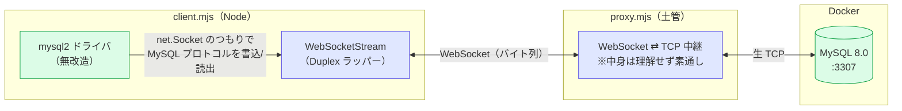
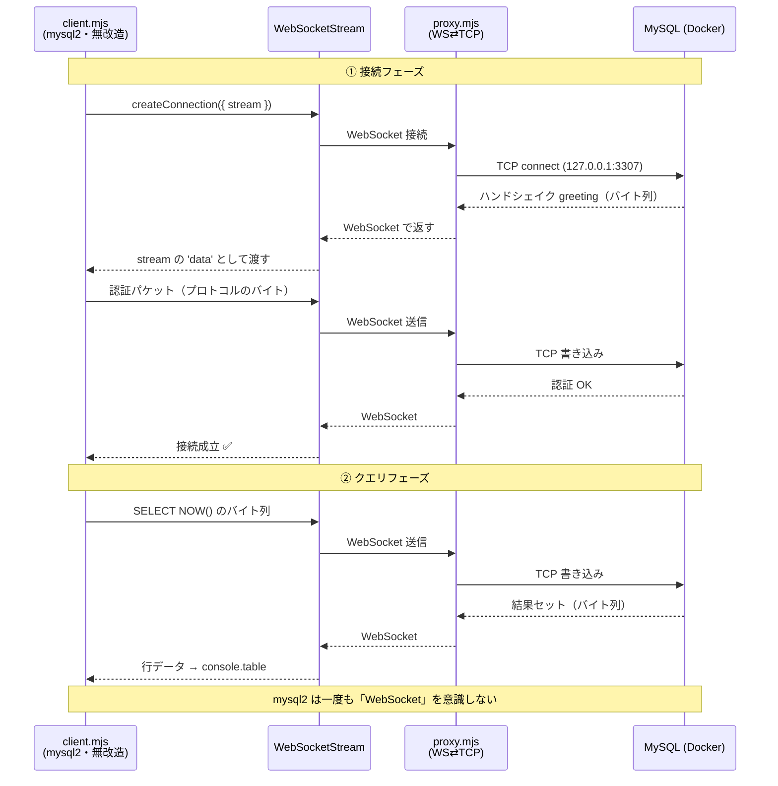

# ws-db-bridge-demo


**「ソケット層の橋渡し」を最小構成で検証**するデモ。

WASM は使いません。**本物の `mysql2` ドライバ**を無改造のまま使い、その**トランスポート（土管）だけを TCP → WebSocket にすげ替え**ます。
MySQL プロトコルのバイト列は WebSocket を通り、プロキシが本物の TCP に中継して MySQL に届きます。

> 検証したいこと：「ドライバは無改造のまま、足元のソケットを WebSocket に差し替えても動くのか？」 → **動く**。

## 仕組み

```
client.mjs（本物の mysql2 ドライバ・無改造）
   │ stream オプションに「WebSocket製の Duplex」を渡す
   │ mysql2 は普通の net.Socket を使っているつもり
   ▼ MySQLプロトコルのバイト列を WebSocket で送信
proxy.mjs（WebSocket ⇄ TCP プロキシ＝土管。中身は理解しない）
   ▼ 受け取ったバイトを本物の TCP で素通し
MySQL（Docker, :3307）
```

- `ws-stream.mjs` … WebSocket を Node の `Duplex` に見せかけるラッパー（＝橋渡しの本体）
- `proxy.mjs` … WebSocket で受けたバイトを TCP へ中継するだけの土管（websockify 相当）
- `client.mjs` … `mysql2.createConnection({ stream: () => new WebSocketStream(...) })` で接続

### 構成図（Mermaid）



> 緑＝「本物（無改造のドライバ／本物のDB）」、青＝「すげ替えた土管」。
> ドライバは緑のまま、間の土管だけ青に差し替わっている＝**ソケット層の橋渡し**。

### 動作シーケンス（Mermaid）



## ディレクトリ構成

```
websocket-db-bridge-demo/
├─ docker/
│  ├─ docker-compose.yml   # MySQL 8.0 を起動（ホスト 3307 → コンテナ 3306）
│  └─ init.sql             # 起動時に投入するサンプルデータ（todos テーブル）
├─ src/
│  ├─ proxy.mjs            # WebSocket ⇄ TCP プロキシ（土管 / websockify 相当）
│  ├─ ws-stream.mjs        # WebSocket を Duplex に見せかけるラッパー（橋渡しの本体）
│  └─ client.mjs           # 本物の mysql2 + WebSocket トランスポートで接続・クエリ
├─ package.json            # 依存（mysql2, ws）とスクリプト
└─ README.md
```

## 動かし方

```bash
npm install
npm run db:up          # MySQL を Docker 起動（= docker compose -f docker/docker-compose.yml up -d）
npm run proxy          # 別ターミナルでプロキシ起動（= node src/proxy.mjs）
npm run client         # クライアント実行（= node src/client.mjs）
```

## 検証結果（実際の出力）

```
✅ 接続成功（この接続はTCP直結ではなくWebSocket経由）
SELECT NOW(), VERSION(): { now: ..., version: '8.0.46', conn_id: 18 }
SELECT * FROM todos: （4行）
INSERT 後の件数: 5
✅ すべて WebSocket トンネル経由で実行完了。mysql2 は無改造のまま動いた。
```

プロキシ側ログ：
```
[proxy] session closed.  ws→tcp 397B,  tcp→ws 813B
        ↑ これが MySQL プロトコルのバイト列。土管は中身を理解せず素通し
```

→ **本物の mysql2 が WebSocket 越しに MySQL と会話できた**ことが確認できる。

## ここで分かること

| 項目 | 結果 |
|------|------|
| ドライバ（mysql2）の改造 | **不要**（`stream` オプションに差すだけ） |
| MySQL プロトコルの自前実装 | **不要**（mysql2 が喋る） |
| 橋渡しの場所 | ドライバの下＝**ソケット(stream)層** |
| プロキシの役割 | バイトを素通しする土管（プロトコルは知らない） |

## アプリ側（Express 等）のコードは変わらない

この方式の重要な性質：**Express などアプリ側のコードは一切変わらない**。
Express は DB と直接話さず mysql2（ドライバ）を使うだけで、すげ替えは
ドライバの「接続の足元（transport）」で起きるため、その上からは見えない。

```
Express のルート/クエリ   ← 無改造（同じ）
      │
mysql2（ドライバ）        ← 無改造
      │ stream オプションだけ差し替え   ← 変わるのはここだけ
WebSocket / TCP
```

変わるのは「接続/プールを作る 1 箇所」だけ：

```javascript
// 普通（TCP直結）
const pool = mysql.createPool({ host, user, password, database });

// WebSocket経由（stream を差すだけ）
const pool = mysql.createPool({
  user, password, database,
  stream: () => new WebSocketStream('ws://.../'),  // ← これを足すだけ
});

// ↓ ここから下の Express コードは“まったく同じ”
app.get('/todos', async (req, res) => {
  const [rows] = await pool.query('SELECT * FROM todos'); // 完全に同じ
  res.json(rows);
});
app.post('/todos', async (req, res) => {
  await pool.query('INSERT INTO todos (task) VALUES (?)', [req.body.task]);
  res.sendStatus(201);
});
```

**プールの注意点（1つだけ）**：プールは接続を複数張るので、`stream` は
「呼ばれるたびに新しいストリームを返す**関数**」で渡す（接続ごとに新ストリームが要る）。

```javascript
stream: () => new WebSocketStream(WS_URL)  // 関数で渡す
```

→ ルート定義・`pool.query()`・SQL は全部そのまま。「接続を作る瞬間に `stream` を渡すか」の違いだけ。

## ブラウザでやる場合との関係

このデモは Node 上で動かしているが、**「ドライバの足元の socket を WebSocket に差し替える」**という仕組みはブラウザでも同じ。
ただしブラウザで `mysql2` 自体を動かすには Node ランタイムが要る（= NodePod 等の WASM）。
そのとき `net` ポリフィルがここでいう `ws-stream.mjs` と同じ役割を果たし、socket を WebSocket に橋渡しする。

- このデモ … 橋渡しの**仕組みそのもの**を Node で素直に検証
- ブラウザ実運用 … 同じ橋渡しを WASM ランタイムのソケット層で行う（PHP-WASM が PDO で実際にやっているのもこれ）

## 後片付け

```bash
npm run db:down        # MySQL コンテナとデータを削除（= docker compose -f docker/docker-compose.yml down -v）
```

## 備考

- 文字化け対策：日本語データの mojibake を防ぐため 2 か所で文字セットを utf8mb4 に揃えている。
  - `docker/init.sql` 冒頭の `SET NAMES utf8mb4;`
    … これが無いと公式イメージの初期化時に mysql クライアントが latin1 で読み込み、
    日本語が二重エンコードされて DB に保存されてしまう（保存時点で壊れる）。
  - `src/client.mjs` の `charset: 'utf8mb4'`
    … 接続側を明示しないと結果文字列の読み出しで化ける。
- `mysql2` の `stream` オプションは公式機能（[Extra Features](https://sidorares.github.io/node-mysql2/docs/documentation/extras)）。
